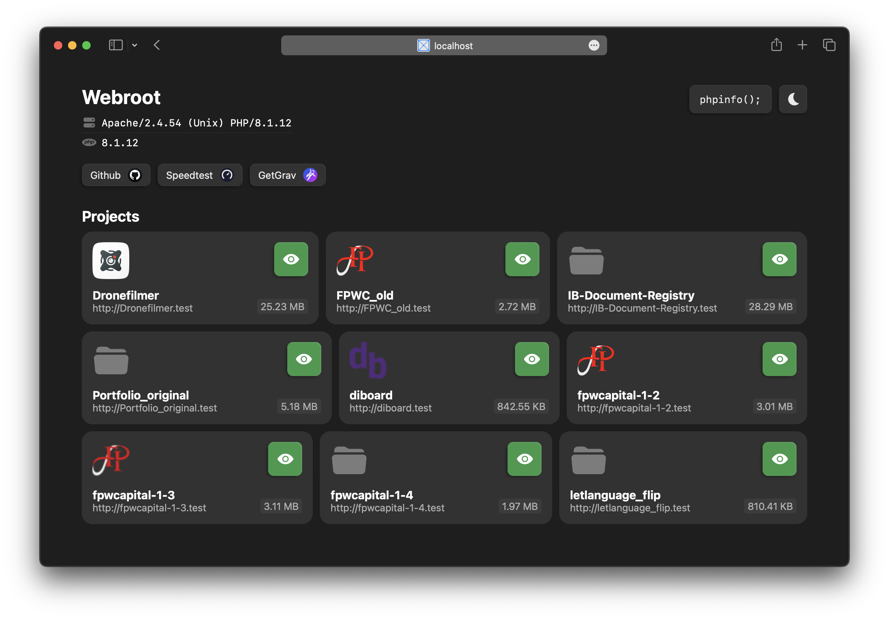

# localhost Web Server GUI

A small interface for a local Apache developement environment.



## Context

A few years ago, I stumbled upon a blog entry explaining to me how I could go about setting up a local Apache, PHP and MySQL development server on my machine. This article is the main inspiration for this project.

## Requirements

This small package is comprised of some files that serve as an interface for a local Apache web server. There are many different ways to go about setting up a local server. [This](https://getgrav.org/blog/macos-monterey-apache-multiple-php-versions) article is a good start for macOS.

I have tested this with an Apache developement server on macOS 12.6.1 Monterey and Ubuntu 22.04.1 (WSL, Windows 11). [25/11/22]

### httpd-vhosts.conf

I had to make some modifications to the `httpd` configuration, specifically regarding virtual hosts. This is mainly to allow for the default ('home.test' for me) URL to be served alongside the wildcarded project folders that serve my projects.

This is the state of my current httpd-vhosts.conf file on macOS, as an example. Other systems may require additional configuration.

```apacheconf
<Virtualhost *:80>
    DocumentRoot "/Users/[homefolder]/Sites"
    ServerName localhost
</Virtualhost>

<Virtualhost *:80>
    VirtualDocumentRoot "/Users/[homefolder]/Sites/%1"
    ServerAlias *.test
    UseCanonicalName Off
</Virtualhost>
```

This configuration will allow '[project_name].test' to be served.

## Installation

All that is needed, is too install and configure the local server environment on your machine, and drop the php files into your newly created local web root folder. From there, creating a new static project only requires the creation of a new folder containing an `index.html` at minimum, and the homepage should pick up the project from the same directory. A `favicon.ico` or `favicon.png` will be picked up automatically as well, if there is one.

Editing the links can be done in the index.php file.
